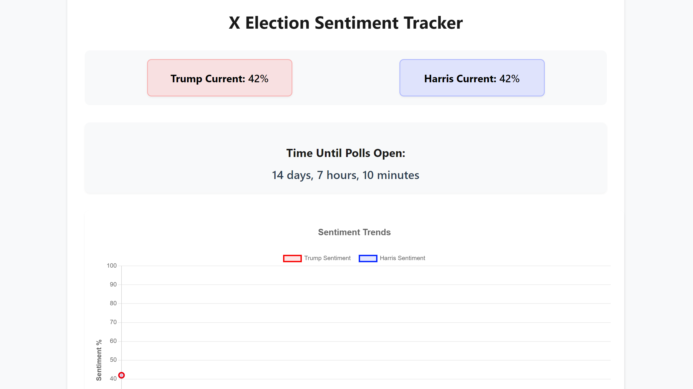

# 🏁 2024 Presidential Race Sentiment Tracker 🏁

## The Race to November 5th: Trump vs Harris

A real-time sentiment analysis dashboard tracking public opinion on X for the unprecedented 2024 presidential race between Donald Trump and Kamala Harris. Watch as the sentiment battle unfolds, updated every hour between now and until the polls open November 5th!



### 🎯 What We're Tracking

- **Live Sentiment Analysis**: Using xAI's Grok API to analyze thousands of X posts
- **Two Contenders**: 
  - 🐘 Donald Trump (Red Line)
  - 🐴 Kamala Harris (Blue Line)
- **Updates Every Hour**: Fresh data 24/7
- **Countdown to Polls**: Live countdown to November 5th, 6 AM
- **Historical Trends**: Track how sentiment changes over time

### 🛠️ Tech Stack

- Frontend: HTML, CSS, Chart.js
- Backend: PowerShell automation
- API: xAI/Grok API integration
- Data Storage: JSON
- Visualization: Real-time line charts

### 📊 How It Works

1. Every hour, our script analyzes current X sentiment. Sentiment is tracked as who the people believe is winning at that time. 
2. Sentiment scores range from 0-100%
3. Data is stored and visualized in real-time
4. Historical trends show momentum shifts
5. Countdown timer shows time until polls open

### 🎮 The Game

Watch the race unfold as two distinct lines battle for position:
- **Red Line**: Trump sentiment
- **Blue Line**: Harris sentiment

Who will maintain better sentiment as we approach Election Day? Will there be dramatic shifts? Major events causing sentiment swings?

### 🚀 Getting Started

1. Clone the repository:
```bash
git clone https://github.com/yourusername/x-election-tracker.git
```

2. Set up your xAI API key in the configuration

3. Install required tools:
   - PowerShell 7+
   - Modern web browser
   - VS Code (recommended)

4. Run the initial setup:
```powershell
.\update_dashboard.ps1
```

5. Open index.html in your browser

### 📈 Contributing

Want to improve the tracker? We welcome:
- Enhanced visualizations
- Additional metrics
- UI/UX improvements
- Bug fixes
- Documentation improvements

### 📝 License

MIT License - Feel free to use, modify, and distribute!

### 🎨 Customization

Want to track different candidates or topics? The codebase is easily adaptable for various sentiment tracking needs.

### 🤝 Credits

- xAI/Grok API for sentiment analysis
- Chart.js for visualization
- Special thanks to the open-source community

### 📫 Contact

- X: @CREdebtDorian

---
